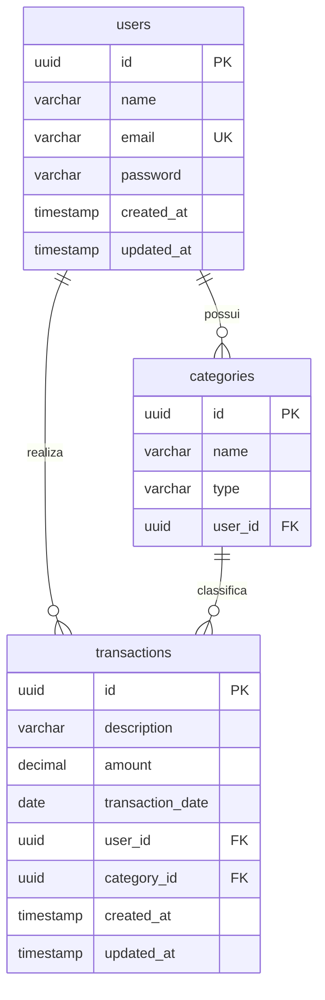

# Diretrizes de Desenvolvimento e Arquitetura - FLUXO

Este documento serve como guia completo para Agentes de IA (como Antigravity, Cursor, etc.) e desenvolvedores trabalhando no projeto **FLUXO**. Ele detalha a arquitetura do sistema, as convenções de código, o banco de dados e o sistema de design a ser seguido rigorosamente.

---

## 🚀 1. Visão Geral do FLUXO

O **FLUXO** é um sistema de administração financeira projetado para fornecer controle completo de despesas, receitas e análises de saldo. O projeto é estruturado como um monorepo dividido em duas partes principais:

- **Cliente (`/client`):** Frontend moderno construído com Vite, React 19, TypeScript e TailwindCSS v4.
- **Servidor (`/server`):** Backend robusto baseado em Java 21, Spring Boot 4.0.x, JPA/Hibernate e PostgreSQL 17.

---

## 🏗️ 2. Arquitetura e Tech Stack

### Backend

- **Linguagem:** Java 21
- **Framework:** Spring Boot 4.0.6
- **Persistência:** Spring Data JPA / Hibernate
- **Banco de Dados:** PostgreSQL 17
- **Segurança:** Spring Security (configurado com permissão total em ambiente de dev)
- **Documentação:** Springdoc OpenAPI / Swagger UI
- **Utilitários:** Lombok
- **Gerenciador de Dependências:** Maven

### Frontend

- **Gerenciador de Pacotes:** `pnpm`
- **Ferramenta de Build:** Vite
- **Framework UI:** React 19 + TypeScript
- **Estilização:** TailwindCSS v4 (com suporte nativo a arquivos CSS customizados)

---

## 🗄️ 3. Modelo de Banco de Dados

O banco de dados é executado em um contêiner Docker (PostgreSQL 17) mapeado na porta `5432` com o banco `fluxo`. O Hibernate está configurado atualmente com `ddl-auto: update` para sincronizar automaticamente as entidades JPA. O Flyway está configurado para controle de migrações futuras, mas encontra-se desativado no momento (`spring.flyway.enabled: false`).

### Diagrama de Entidade-Relacionamento (ERD)



### Detalhes das Entidades JPA Principais

1.  **User ([User.java](file:///Users/casseb/Develop/dev/projects/FLUXO/server/src/main/java/com/pedrocasseb/fluxo/user/User.java)):**
    - Tabela: `users`
    - Chave Primária: `UUID` auto-gerada.
    - Restrições: `email` é chave única (`UK`) e não nulo.
    - Relacionamentos: `OneToMany` com `Category` e `FinancialTransaction` (ambos com `FetchType.LAZY`).

2.  **Category ([Category.java](file:///Users/casseb/Develop/dev/projects/FLUXO/server/src/main/java/com/pedrocasseb/fluxo/category/Category.java)):**
    - Tabela: `categories`
    - Campos: `id`, `name`, `type` (mapeado para o enum `CategoryType` como String: `INCOME` ou `EXPENSE`), `user_id` (Chave Estrangeira apontando para `users`).
    - Relacionamentos: `ManyToOne` com `User` (carregamento LAZY).

3.  **FinancialTransaction ([FinancialTransaction.java](file:///Users/casseb/Develop/dev/projects/FLUXO/server/src/main/java/com/pedrocasseb/fluxo/transaction/FinancialTransaction.java)):**
    - Tabela: `transactions`
    - Campos: `id`, `description`, `amount` (BigDecimal), `transaction_date` (LocalDate), `user_id`, `category_id`, timestamps de criação e modificação.
    - Relacionamentos: `ManyToOne` com `User` e `Category` (ambos com `FetchType.LAZY`).

---

## 🎨 4. Alinhamento de Design (Frontend)

O frontend do FLUXO deve refletir a estética e as regras especificadas no documento [desing.md](file:///Users/casseb/Develop/dev/projects/FLUXO/docs/desing.md). Este design é fortemente inspirado no estilo visual da Stripe ("Stripi"), caracterizado por cores escuras profundas, um tom de azul/índigo elétrico, e o uso de degradês atmosféricos.

### Paleta de Cores e Tokens

Qualquer componente adicionado ao frontend deve utilizar estes códigos de cor exatos ou variáveis equivalentes (a serem configuradas no TailwindCSS):

- **Principal:** Indigo Elétrico (`#533afd`) — reservado apenas para botões de CTA principal e destaques de links.
- **Fundo padrão:** Canvas Branco (`#ffffff`) para seções comuns, e Off-White Gelado (`#f6f9fc`) para cartões e faixas de conteúdo secundário.
- **Texto Principal:** Navy Escuro Ink (`#0d253d`) — evite usar preto puro (`#000000`).
- **Acento Cream:** Cream Quente (`#f5e9d4`) — usado em cartões de destaque específicos para quebrar o padrão frio de cores.
- **Linhas e Divisores:** Hairline Cinza-Azulado (`#e3e8ee` para tabelas/borda geral, `#a8c3de` para inputs).

### Regras de Tipografia e Números

- **Fontes:** Utilizar a fonte **Inter** (peso `300` para títulos e parágrafos normais, `400` para botões e captions).
- **Títulos e Displays:** Devem ter peso **300** e **tracking (letter-spacing) negativo** (de `-0.2px` a `-1.4px` dependendo do tamanho). Títulos com peso normal ou negrito quebram a estética editorial leve.
- **Valores Financeiros:** **OBRIGATÓRIO** o uso da propriedade `font-feature-settings: "tnum"` (tabular figures) em tabelas ou elementos que mostrem valores monetários. Isso garante que os números tenham largura idêntica, alinhando as colunas numéricas perfeitamente.
- **Substituição Global:** Configurar `font-feature-settings: "ss01"` globalmente no elemento `body` para habilitar caracteres estilizados.

### Elementos Visuais Obrigatórios nas Páginas

- **Gradient Mesh Backdrop:** A parte superior da tela principal ou landing page deve ter um degradê horizontal orgânico (SVG ou imagem) mesclando tons pastéis de creme, laranja sherbet, lavanda, índigo elétrico e rosa rubi.
- **Pill Buttons:** Todos os botões devem ter bordas totalmente arredondadas (`rounded-full`, 9999px) com espaçamento apertado (`8px 16px` para médio, `6px 12px` para pequeno).
- **Composited Dashboard Mockup:** As exibições de dados do dashboard devem parecer painéis ou consoles integrados em fundo escuro/navy (`#1c1e54` ou `#0d253d`), com sombras sutis (Nível 2).

---

## 🎯 5. Diretrizes de Desenvolvimento Backend

Ao estender o servidor Java, os agentes devem seguir o padrão corporativo Spring Boot implementado:

1.  **Separação de Camadas:**
    - **Controller:** Responsável por expor os endpoints REST, gerenciar requisições, CORS e mapear DTOs.
    - **Service:** Concentra toda a lógica de negócio, transações e validações.
    - **Repository:** Interfaces Spring Data JPA estendendo `JpaRepository<Entity, UUID>`.
    - **DTO (Data Transfer Objects):** Todos os dados recebidos ou enviados devem usar DTOs na pasta `dto` de cada domínio. **Nunca expor as entidades JPA diretamente nos Controllers.**

2.  **Lombok:**
    - Utilizar anotações Lombok para manter os arquivos limpos: `@Getter`, `@Setter`, `@NoArgsConstructor`, `@AllArgsConstructor` e `@Builder` (quando aplicável). Evite usar a anotação genérica `@Data` em entidades JPA para prevenir problemas de recursividade no `toString()` ou `hashCode()`.

3.  **Validações:**
    - Utilizar anotações do pacote `jakarta.validation.constraints` (ex: `@NotNull`, `@NotBlank`, `@Size`, `@DecimalMin`) nos DTOs de requisição e anotar os parâmetros dos Controllers com `@Valid`.

4.  **Relacionamentos JPA:**
    - Manter `fetch = FetchType.LAZY` para todos os relacionamentos `@ManyToOne` ou `@OneToMany` para evitar problemas de performance com consultas N+1.

---

## 🤖 6. Diretrizes e Regras Específicas para Agentes de IA

Qualquer Agente de IA trabalhando neste projeto deve seguir rigorosamente as regras abaixo:

- **Sem Placeholders:** Não escreva códigos com comentários como `// TODO: implementar depois` ou métodos que retornam valores estáticos em produção. Escreva a implementação real e completa.
- **Preservar Comentários e Licenças:** Nunca altere ou apague comentários, cabeçalhos de licença ou docstrings que já existem nas classes, a menos que seja explicitamente solicitado ou que o código antigo esteja sendo substituído por completo.
- **Estética Visual Premium:** Ao mexer no código do frontend (`/client`), nunca use designs simplistas. Siga à risca os componentes, fontes e cores do design "Stripi" descrito em `docs/desing.md`. Uma interface genérica é considerada uma falha grave de implementação.
- **Links para Arquivos:** Ao sugerir ou responder ao usuário, crie links clicáveis com o esquema de markdown padrão contendo `file://` apontando para os arquivos do workspace (ex: `[User.java](file:///Users/casseb/Develop/dev/projects/FLUXO/server/src/main/java/com/pedrocasseb/fluxo/user/User.java)`).

---

## 💻 7. Configuração e Comandos Úteis

### Setup do Banco de Dados

Para iniciar o banco PostgreSQL localmente:

```bash
docker compose up -d
```

As credenciais e conexões utilizam o arquivo [.env](file:///Users/casseb/Develop/dev/projects/FLUXO/.env) na raiz do projeto.

### Rodando o Servidor (Backend)

Entre no diretório `/server` e utilize o Maven Wrapper para iniciar:

```bash
# Executar o Spring Boot
./mvnw spring-boot:run
```

### Rodando o Cliente (Frontend)

Entre no diretório `/client` e instale as dependências com `pnpm`:

```bash
# Instalar dependências
pnpm install

# Rodar servidor de desenvolvimento (Vite)
pnpm dev
```

---

## 📋 8. Roadmap e Status de Implementação

O projeto está em fase inicial de desenvolvimento. Abaixo está a lista de tarefas pendentes e áreas que necessitam de implementação:

| Módulo     | Funcionalidade / Tarefa                                                 |    Status    | Arquivo / Diretório Principal     |
| :--------- | :---------------------------------------------------------------------- | :----------: | :-------------------------------- |
| **Server** | Criação das Entidades Base (`User`, `Category`, `FinancialTransaction`) | ✅ Concluído | `com.pedrocasseb.fluxo.*`         |
| **Server** | Criação de Controllers básicos para transações e categorias             | ✅ Concluído | `com.pedrocasseb.fluxo.*`         |
| **Server** | Implementação de Autenticação JWT no pacote `auth`                      | ✅ Concluído | `com.pedrocasseb.fluxo.auth`      |
| **Server** | Lógica de agregação de relatórios no pacote `analytics`                 | ✅ Concluído | `com.pedrocasseb.fluxo.analytics` |
| **Client** | Configuração inicial do projeto React com TailwindCSS v4                | ✅ Concluído | `client/`                         |
| **Client** | Implementação da estrutura de páginas do Dashboard (Layout base)        | ⏳ Pendente  | `client/src/`                     |
| **Client** | Integração com as APIs de transações e categorias                       | ⏳ Pendente  | `client/src/`                     |
| **Client** | Implementação de Gráficos e Relatórios visuais (com estilo Stripi)      | ⏳ Pendente  | `client/src/`                     |

## Antes de criar um novo arquivo:

1. Procure se já existe implementação semelhante.
2. Reutilize componentes existentes.
3. Não duplique lógica.
4. Mantenha consistência com o restante do projeto.
