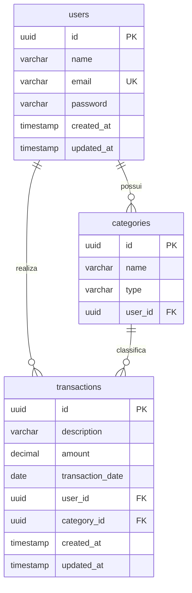

# Diretrizes de Desenvolvimento e Arquitetura - FLUXO

Este documento serve como guia completo para Agentes de IA (como Antigravity, Cursor, etc.) e desenvolvedores trabalhando no projeto **FLUXO**. Ele detalha a arquitetura do sistema, as convenções de código, o banco de dados e o sistema de design a ser seguido rigorosamente.

---

## 🚀 1. Visão Geral do FLUXO

O **FLUXO** é um sistema de administração financeira projetado para fornecer controle completo de despesas, receitas e análises de saldo. O projeto é estruturado como um monorepo dividido em duas partes principais:

- **Cliente (`/client`):** Frontend moderno construído com Vite, React 19, TypeScript e TailwindCSS v4.
- **Servidor (`/server`):** Backend robusto baseado em Java 21, Spring Boot 4.0.x, JPA/Hibernate e PostgreSQL 17.

---

## 🏗️ 2. Arquitetura e Tech Stack

### Backend

- **Linguagem:** Java 21
- **Framework:** Spring Boot 4.0.6
- **Persistência:** Spring Data JPA / Hibernate
- **Banco de Dados:** PostgreSQL 17
- **Segurança:** Spring Security stateless com JWT. Só `/auth/register`, `/auth/login` e as rotas do Swagger são públicas; todo o resto exige `Authorization: Bearer <token>`.
- **Documentação:** Springdoc OpenAPI / Swagger UI
- **Utilitários:** Lombok
- **Gerenciador de Dependências:** Maven

### Frontend

- **Gerenciador de Pacotes:** `pnpm`
- **Ferramenta de Build:** Vite
- **Framework UI:** React 19 + TypeScript
- **Estilização:** TailwindCSS v4 (com suporte nativo a arquivos CSS customizados)

---

## 🗄️ 3. Modelo de Banco de Dados

O banco de dados é executado em um contêiner Docker (PostgreSQL 17) mapeado na porta `5432` com o banco `fluxo`. O Hibernate está configurado atualmente com `ddl-auto: update` para sincronizar automaticamente as entidades JPA. O Flyway está configurado para controle de migrações futuras, mas encontra-se desativado no momento (`spring.flyway.enabled: false`).

### Diagrama de Entidade-Relacionamento (ERD)



### Detalhes das Entidades JPA Principais

1.  **User ([User.java](file:///Users/casseb/Develop/dev/projects/FLUXO/server/src/main/java/com/pedrocasseb/fluxo/user/User.java)):**
    - Tabela: `users`
    - Chave Primária: `UUID` auto-gerada.
    - Restrições: `email` é chave única (`UK`) e não nulo.
    - Relacionamentos: `OneToMany` com `Category` e `FinancialTransaction` (ambos com `FetchType.LAZY`).

2.  **Category ([Category.java](file:///Users/casseb/Develop/dev/projects/FLUXO/server/src/main/java/com/pedrocasseb/fluxo/category/Category.java)):**
    - Tabela: `categories`
    - Campos: `id`, `name`, `type` (mapeado para o enum `CategoryType` como String: `INCOME`, `EXPENSE` ou `INVESTMENT`), `user_id` (Chave Estrangeira apontando para `users`).
    - Relacionamentos: `ManyToOne` com `User` (carregamento LAZY).
    - **Atenção (Hibernate `ddl-auto: update`):** o Postgres tem uma CHECK constraint (`categories_type_check`) gerada a partir do enum. Se o enum ganhar um valor novo, o Hibernate **não** atualiza a constraint existente em bancos já criados — só em bancos novos. Se um insert falhar com `violates check constraint "categories_type_check"`, rode manualmente:
      ```sql
      ALTER TABLE categories DROP CONSTRAINT categories_type_check;
      ALTER TABLE categories ADD CONSTRAINT categories_type_check CHECK (type IN ('INCOME','EXPENSE','INVESTMENT'));
      ```

3.  **FinancialTransaction ([FinancialTransaction.java](file:///Users/casseb/Develop/dev/projects/FLUXO/server/src/main/java/com/pedrocasseb/fluxo/transaction/FinancialTransaction.java)):**
    - Tabela: `transactions`
    - Campos: `id`, `description`, `amount` (BigDecimal), `transaction_date` (LocalDate), `user_id`, `category_id`, timestamps de criação e modificação.
    - Relacionamentos: `ManyToOne` com `User` e `Category` (ambos com `FetchType.LAZY`).

---

## 🎨 4. Alinhamento de Design (Frontend)

Não existe um `docs/desing.md` — o design system real vive no código: tokens em [index.css](file:///Users/casseb/Develop/dev/projects/FLUXO/client/src/index.css) e nos componentes já construídos em `client/src/components/`. Qualquer tela nova deve derivar destes tokens em vez de inventar cores/fontes novas.

### Paleta de Cores

- **Fundo padrão:** Cream (`#F5F6F4`) para páginas; branco (`#ffffff`) para cards/painéis sobre o fundo cream.
- **Texto/Ink principal:** `#0E1420` (nunca preto puro `#000000`).
- **Acento de marca:** Roxo (`#4A3AEB`) para CTAs, links e eyebrows; usado em gradiente com Azul (`#4F8CFF`) na marca (`FlowMark`) e em elementos ilustrativos (linha de fluxo de caixa).
- **Bordas/divisores:** `#E4E7E2`.
- **Cores semânticas por `CategoryType`** (usadas de forma consistente em badges, gráficos e valores monetários):
  - `INCOME` (Receita): verde `#1C8C6C`
  - `EXPENSE` (Despesa): marrom/âmbar `#9A5B2E`
  - `INVESTMENT` (Investimento): azul `#2E5CC4`
- **Erro/destrutivo:** texto `#A5402F` sobre fundo `#FBEEE9`, borda `#E8B8AE`.

### Tipografia

Três famílias, cada uma com um papel fixo (ver `--font-display`, `--font-body`, `--font-mono` em `index.css`):
- **Display** (`Bricolage Grotesque`): headlines, títulos de seção, valores monetários de destaque.
- **Body** (`Instrument Sans`): texto corrido, labels, botões.
- **Mono** (`IBM Plex Mono`): eyebrows em uppercase com tracking largo, dados tabulares/timestamps.

### Padrões de Componente Estabelecidos

- **Botões:** `rounded-full`, variante primária `bg-[#0E1420]` com `hover:bg-[#4A3AEB]`.
- **Cards/painéis:** `rounded-2xl`, `border border-[#E4E7E2]`, `bg-white`.
- **Modais/popovers:** entram e saem com fade+scale (`menu-pop-in`/`menu-pop-out`/`modal-pop-in`/`modal-pop-out` em `index.css`), nunca somem instantaneamente — usam o hook `useDelayedMount` para animar a saída antes de desmontar.
- **Motion:** curva de easing padrão do site inteiro é `cubic-bezier(0.22, 1, 0.36, 1)` (`--default-transition-timing-function` em `index.css`, também exportada como `EASE_FLUID` em `lib/motion.ts`). Toda animação nova deve reusar esses tokens, não inventar timing novo.
- **shadcn/ui:** o Calendar/Popover/Button em `client/src/components/ui/` são componentes shadcn vendorizados manualmente (o registro `ui.shadcn.com` é bloqueado neste ambiente de sandbox) e já restilizados com os tokens acima em vez do tema padrão do shadcn.

---

## 🎯 5. Diretrizes de Desenvolvimento Backend

Ao estender o servidor Java, os agentes devem seguir o padrão corporativo Spring Boot implementado:

1.  **Separação de Camadas:**
    - **Controller:** Responsável por expor os endpoints REST, gerenciar requisições, CORS e mapear DTOs.
    - **Service:** Concentra toda a lógica de negócio, transações e validações.
    - **Repository:** Interfaces Spring Data JPA estendendo `JpaRepository<Entity, UUID>`.
    - **DTO (Data Transfer Objects):** Todos os dados recebidos ou enviados devem usar DTOs na pasta `dto` de cada domínio. **Nunca expor as entidades JPA diretamente nos Controllers.**

2.  **Lombok:**
    - Utilizar anotações Lombok para manter os arquivos limpos: `@Getter`, `@Setter`, `@NoArgsConstructor`, `@AllArgsConstructor` e `@Builder` (quando aplicável). Evite usar a anotação genérica `@Data` em entidades JPA para prevenir problemas de recursividade no `toString()` ou `hashCode()`.

3.  **Validações:**
    - Utilizar anotações do pacote `jakarta.validation.constraints` (ex: `@NotNull`, `@NotBlank`, `@Size`, `@DecimalMin`) nos DTOs de requisição e anotar os parâmetros dos Controllers com `@Valid`.

4.  **Relacionamentos JPA:**
    - Manter `fetch = FetchType.LAZY` para todos os relacionamentos `@ManyToOne` ou `@OneToMany` para evitar problemas de performance com consultas N+1.

---

## 🤖 6. Diretrizes e Regras Específicas para Agentes de IA

Qualquer Agente de IA trabalhando neste projeto deve seguir rigorosamente as regras abaixo:

- **Sem Placeholders:** Não escreva códigos com comentários como `// TODO: implementar depois` ou métodos que retornam valores estáticos em produção. Escreva a implementação real e completa.
- **Preservar Comentários e Licenças:** Nunca altere ou apague comentários, cabeçalhos de licença ou docstrings que já existem nas classes, a menos que seja explicitamente solicitado ou que o código antigo esteja sendo substituído por completo.
- **Estética Visual Premium:** Ao mexer no código do frontend (`/client`), nunca use designs simplistas. Siga à risca os tokens e padrões de componente descritos na seção 4 deste documento. Uma interface genérica é considerada uma falha grave de implementação.
- **Links para Arquivos:** Ao sugerir ou responder ao usuário, crie links clicáveis com o esquema de markdown padrão contendo `file://` apontando para os arquivos do workspace (ex: `[User.java](file:///Users/casseb/Develop/dev/projects/FLUXO/server/src/main/java/com/pedrocasseb/fluxo/user/User.java)`).

---

## 💻 7. Configuração e Comandos Úteis

### Setup do Banco de Dados

Para iniciar o banco PostgreSQL localmente:

```bash
docker compose up -d
```

As credenciais e conexões utilizam o arquivo [.env](file:///Users/casseb/Develop/dev/projects/FLUXO/.env) na raiz do projeto.

### Rodando o Servidor (Backend)

Entre no diretório `/server` e utilize o Maven Wrapper para iniciar:

```bash
# Executar o Spring Boot
./mvnw spring-boot:run
```

### Rodando o Cliente (Frontend)

Entre no diretório `/client` e instale as dependências com `pnpm`:

```bash
# Instalar dependências
pnpm install

# Rodar servidor de desenvolvimento (Vite)
pnpm dev
```

---

## 📋 8. Roadmap e Status de Implementação

| Módulo     | Funcionalidade / Tarefa                                                     |    Status    | Arquivo / Diretório Principal                    |
| :--------- | :--------------------------------------------------------------------------- | :----------: | :------------------------------------------------ |
| **Server** | Entidades Base (`User`, `Category`, `FinancialTransaction`)                | ✅ Concluído | `com.pedrocasseb.fluxo.*`                          |
| **Server** | Autenticação JWT (`/auth/register`, `/auth/login`, `/auth/me`)             | ✅ Concluído | `com.pedrocasseb.fluxo.auth`                       |
| **Server** | CRUD de Categorias e Transações com isolamento por usuário                 | ✅ Concluído | `com.pedrocasseb.fluxo.category`, `.transaction`   |
| **Server** | Categoria padrão "Other" por tipo (Receita/Despesa/Investimento)           | ✅ Concluído | `TransactionService.resolveCategory`               |
| **Server** | Agregação de dashboard (`/api/dashboard`: resumo, comparações, insights)   | ✅ Concluído | `com.pedrocasseb.fluxo.analytics`                  |
| **Server** | Validação de entrada (`@Valid`) + tratamento de erro (409 conflito de FK, 400 JSON malformado) | ✅ Concluído | `GlobalExceptionHandler`                           |
| **Server** | CORS liberado para `http://localhost:5173`                                | ✅ Concluído | `SecurityConfig.corsConfigurationSource`           |
| **Client** | Landing page (hero, features, pricing)                                    | ✅ Concluído | `client/src/pages/LandingPage.tsx`                 |
| **Client** | Login / Cadastro com integração real à API                                | ✅ Concluído | `client/src/pages/LoginPage.tsx`, `SignupPage.tsx` |
| **Client** | Rotas protegidas (`ProtectedRoute`) e redirect se já logado (`RedirectIfAuthenticated`) | ✅ Concluído | `client/src/components/auth/`                      |
| **Client** | Dashboard com saldo, cards de comparação mensal, gráfico de evolução (SVG) e ranking de despesas por categoria | ✅ Concluído | `client/src/pages/DashboardPage.tsx`, `components/dashboard/` |
| **Client** | CRUD de Categorias (colunas por tipo) e Transações (filtros, ordenação, date picker shadcn) | ✅ Concluído | `client/src/pages/CategoriesPage.tsx`, `TransactionsPage.tsx` |
| **Client** | Menu de usuário com logout (popover)                                        | ✅ Concluído | `client/src/components/dashboard/UserMenu.tsx`     |
| **Pendente** | Página de perfil/configurações de conta (endpoints `/api/users/*` já existem, sem UI) | ⏳ Pendente  | `com.pedrocasseb.fluxo.user`                       |
| **Pendente** | Exportação de relatórios / CSV (mencionado na landing, não implementado)  | ⏳ Pendente  | —                                                   |
| **Pendente** | Fluxo de "esqueci minha senha" (sem endpoint no backend ainda)            | ⏳ Pendente  | —                                                   |
| **Pendente** | Migração de `ddl-auto: update` para Flyway (já no classpath, desativado)  | ⏳ Pendente  | `application.yaml`                                 |

## Antes de criar um novo arquivo:

1. Procure se já existe implementação semelhante.
2. Reutilize componentes existentes.
3. Não duplique lógica.
4. Mantenha consistência com o restante do projeto.
