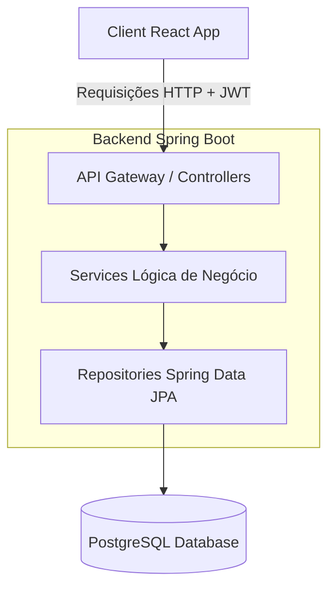

# Arquitetura do Sistema - FLUXO

Este documento descreve a arquitetura geral do sistema **FLUXO**, abrangendo a divisão entre cliente e servidor, padrões de projeto, fluxo de dados e decisões de segurança.

---

## 1. Visão Geral do Sistema

O FLUXO é um monorepo dividido em duas grandes frentes:
1. **Frontend (`/client`)**: Interface com o usuário construída com React 19, TypeScript e TailwindCSS v4.
2. **Backend (`/server`)**: API REST robusta construída com Java 21, Spring Boot 4.x, Spring Security e Spring Data JPA, utilizando PostgreSQL 17 como banco de dados.

---

## 2. Arquitetura do Backend (Server)

O servidor Spring Boot segue a clássica arquitetura de camadas com foco em isolamento de domínio e alta coesão:

### 2.1. Camada de Apresentação (Controllers)
- Responsável por expor os endpoints REST do sistema.
- Mapeia e valida as requisições HTTP recebidas via anotações `jakarta.validation` (`@Valid`, `@NotBlank`, etc.).
- Faz o mapeamento entre objetos de transferência (DTOs) e respostas REST.
- **Regra:** Entidades JPA nunca são expostas diretamente nos Controllers.

### 2.2. Camada de Negócio (Services)
- Concentra toda a lógica de negócio do sistema.
- Gerencia transações (`@Transactional`) e orquestra o fluxo de dados.
- Garante o isolamento de dados por usuário, assegurando que operações de leitura, escrita e exclusão atuem somente nas entidades vinculadas ao usuário autenticado.

### 2.3. Camada de Persistência (Repositories)
- Interfaces que estendem `JpaRepository<Entity, UUID>` do Spring Data JPA.
- Contêm as queries customizadas necessárias para busca eficiente com isolamento de usuário (ex: `findByUser`, `findByIdAndUser`).

### 2.4. Tratamento Global de Exceções
- Centralizado através de um `@RestControllerAdvice` no pacote `com.pedrocasseb.fluxo.common.GlobalExceptionHandler`.
- Intercepta erros comuns como recursos não encontrados, erros de validação de formulário (Bean Validation) e violações de unicidade, retornando payloads estruturados de erro com códigos HTTP sem expor stack traces.

---

## 3. Segurança e Autenticação

A segurança é implementada utilizando **Spring Security** de forma stateless baseada em **JWT (JSON Web Tokens)**:

1. **JwtAuthenticationFilter**: Filtro interceptor que extrai o token JWT do header `Authorization` (`Bearer <token>`).
2. **Token validation**: O token é validado por assinatura criptográfica com chave secreta gerida nas variáveis de ambiente.
3. **SecurityContext**: Uma vez válido, os dados do usuário são injetados no contexto de segurança do Spring (`AuthenticationPrincipal`).
4. **Isolamento de Dados**: Todos os controllers passam o objeto do usuário atualmente logado para a camada de serviços para restringir os dados retornados.

---

## 4. Arquitetura do Frontend (Client)

O frontend é focado em alta performance e design premium ("Stripi"):

- **Tecnologias**: React 19, Vite (para build ultrarrápido) e TypeScript (segurança e tipagem).
- **Estilização**: TailwindCSS v4 com arquivos CSS customizados para tokens visuais do design system (Indigo Elétrico, Canvas Off-White, font Inter com tracking negativo).
- **Consumo de API**: Realizado através de requisições assíncronas enviando o Token JWT armazenado com segurança no cliente.
- **Dashboard Financeiro**: Consome o endpoint consolidado `GET /api/dashboard` em uma única chamada para evitar múltiplos requests.
