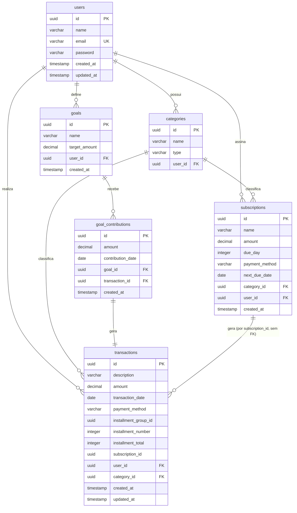

# Documentação do Banco de Dados - FLUXO

Esta documentação descreve a estrutura e modelagem do banco de dados do sistema **FLUXO** no momento atual, baseando-se nas entidades JPA mapeadas no módulo do servidor (`server`).

---

## 1. Visão Geral e Infraestrutura

O ambiente de banco de dados é configurado via contêiner Docker e gerenciado pelo Spring Boot no backend.

- **SGBD:** PostgreSQL 17
- **Porta Padrão:** `5432`
- **Nome do Banco:** `fluxo`
- **Configurações de Conexão:**
  - Definidas no arquivo [application.yaml](file:///Users/casseb/Develop/dev/projects/FLUXO/server/src/main/resources/application.yaml).
  - O serviço local roda a partir do arquivo [docker-compose.yml](file:///Users/casseb/Develop/dev/projects/FLUXO/docker-compose.yml) com credenciais padrões de desenvolvimento (`POSTGRES_USER=postgres` / `POSTGRES_PASSWORD=postgres`).
- **Mecanismo de Geração do Schema:**
  - Atualmente configurado como `spring.jpa.hibernate.ddl-auto: update`, onde o Hibernate sincroniza a estrutura automaticamente com base nas entidades Java.
  - O Flyway está configurado no projeto para migrações futuras, mas atualmente encontra-se desativado (`spring.flyway.enabled: false`).
  - **Limitação conhecida:** `ddl-auto: update` cria a CHECK constraint `categories_type_check` (a partir do enum `CategoryType`) na primeira vez que a tabela é criada, mas **não a atualiza** em bancos já existentes se o enum ganhar um novo valor depois. Um banco criado antes do valor `INVESTMENT` existir vai rejeitar inserts com esse tipo (`violates check constraint "categories_type_check"`) até rodar manualmente:
    ```sql
    ALTER TABLE categories DROP CONSTRAINT categories_type_check;
    ALTER TABLE categories ADD CONSTRAINT categories_type_check CHECK (type IN ('INCOME','EXPENSE','INVESTMENT'));
    ```
    Bancos criados do zero com o código atual não têm esse problema.

---

## 2. Diagrama de Entidade-Relacionamento (ERD)

O diagrama a seguir descreve graficamente as tabelas mapeadas e seus respectivos relacionamentos:



---

## 3. Dicionário de Dados

Abaixo estão detalhadas as tabelas do banco de dados correspondentes às entidades JPA do projeto.

### 3.1. Tabela `users`
Mapeada a partir da entidade [User.java](file:///Users/casseb/Develop/dev/projects/FLUXO/server/src/main/java/com/pedrocasseb/fluxo/user/User.java), esta tabela armazena os dados de registro dos usuários do sistema.

| Coluna | Tipo no Banco | Tipo Java | Chave | Nulidade | Detalhes / Restrições |
| :--- | :--- | :--- | :---: | :---: | :--- |
| `id` | `UUID` | `UUID` | PK | Não Nulo | Identificador único gerado automaticamente (`GenerationType.UUID`). |
| `name` | `VARCHAR(255)` | `String` | - | Nulo | Nome do usuário. |
| `email` | `VARCHAR(255)` | `String` | UK | Não Nulo | Endereço de e-mail do usuário (Restrição de Unicidade). |
| `password` | `VARCHAR(255)` | `String` | - | Nulo | Hash da senha de acesso do usuário. |
| `created_at` | `TIMESTAMP` | `LocalDateTime` | - | Não Nulo | Data e hora de criação do registro (Gerido por `@CreationTimestamp`). |
| `updated_at` | `TIMESTAMP` | `LocalDateTime` | - | Não Nulo | Data e hora da última modificação (Gerido por `@UpdateTimestamp`). |

---

### 3.2. Tabela `categories`
Mapeada a partir da entidade [Category.java](file:///Users/casseb/Develop/dev/projects/FLUXO/server/src/main/java/com/pedrocasseb/fluxo/category/Category.java), esta tabela armazena as categorias criadas pelos usuários para organizar suas transações.

| Coluna | Tipo no Banco | Tipo Java | Chave | Nulidade | Detalhes / Restrições |
| :--- | :--- | :--- | :---: | :---: | :--- |
| `id` | `UUID` | `UUID` | PK | Não Nulo | Identificador único gerado automaticamente (`GenerationType.UUID`). |
| `name` | `VARCHAR(255)` | `String` | - | Nulo | Nome descritivo da categoria. |
| `type` | `VARCHAR(255)` | `CategoryType` | - | Nulo | Tipo da categoria, mapeado como String do enum [CategoryType.java](file:///Users/casseb/Develop/dev/projects/FLUXO/server/src/main/java/com/pedrocasseb/fluxo/category/CategoryType.java) (`INCOME`, `EXPENSE` ou `INVESTMENT`). |
| `user_id` | `UUID` | `User` | FK | Nulo | Referência ao usuário proprietário desta categoria (Chave estrangeira apontando para `users.id`). |

---

### 3.3. Tabela `transactions`
Mapeada a partir da entidade [FinancialTransaction.java](file:///Users/casseb/Develop/dev/projects/FLUXO/server/src/main/java/com/pedrocasseb/fluxo/transaction/FinancialTransaction.java), esta tabela armazena os registros de receitas e despesas efetuadas pelos usuários.

| Coluna | Tipo no Banco | Tipo Java | Chave | Nulidade | Detalhes / Restrições |
| :--- | :--- | :--- | :---: | :---: | :--- |
| `id` | `UUID` | `UUID` | PK | Não Nulo | Identificador único gerado automaticamente (`GenerationType.UUID`). |
| `description` | `VARCHAR(255)` | `String` | - | Nulo | Detalhamento ou título da transação. |
| `amount` | `NUMERIC(38,2)` | `BigDecimal` | - | Nulo | Valor monetário da transação financeira. |
| `transaction_date` | `DATE` | `LocalDate` | - | Nulo | Data de ocorrência (ou vencimento, para parcelas futuras) da transação financeira. |
| `payment_method` | `VARCHAR(255)` | `PaymentMethod` | - | Nulo | Método de pagamento, mapeado como String do enum [PaymentMethod.java](file:///Users/casseb/Develop/dev/projects/FLUXO/server/src/main/java/com/pedrocasseb/fluxo/transaction/PaymentMethod.java) (`CREDIT`, `DEBIT`, `PIX` ou `CASH`). |
| `installment_group_id` | `UUID` | `UUID` | - | Nulo | Identificador compartilhado entre todas as parcelas de uma mesma compra parcelada. `null` para transações avulsas. |
| `installment_number` | `INTEGER` | `Integer` | - | Nulo | Número da parcela (1..N). `null` para transações avulsas. |
| `installment_total` | `INTEGER` | `Integer` | - | Nulo | Total de parcelas da compra (N). `null` para transações avulsas. |
| `subscription_id` | `UUID` | `UUID` | - | Nulo | Referência solta (sem FK) à assinatura que gerou esta transação automaticamente. **Não é apagado/atualizado quando a assinatura é excluída** — é só uma marcação histórica de origem. `null` para transações que não vieram de assinatura. |
| `user_id` | `UUID` | `User` | FK | Nulo | Referência ao usuário que realizou a transação (Chave estrangeira apontando para `users.id`). |
| `category_id` | `UUID` | `Category` | FK | Nulo | Referência à categoria da transação (Chave estrangeira apontando para `categories.id`). |
| `created_at` | `TIMESTAMP` | `LocalDateTime` | - | Não Nulo | Data e hora de criação do registro (Gerido por `@CreationTimestamp`). |
| `updated_at` | `TIMESTAMP` | `LocalDateTime` | - | Não Nulo | Data e hora da última modificação (Gerido por `@UpdateTimestamp`). |

**Compras parceladas:** `POST /api/transactions/installments` cria N linhas de uma vez (uma por parcela, uma por mês), todas com `payment_method = CREDIT` e o mesmo `installment_group_id`. Excluir qualquer parcela do grupo exclui todas. **Parcelas com `transaction_date` futuro não entram no saldo/resumo do dashboard até a data chegar** (ver [docs/api.md](file:///Users/casseb/Develop/dev/projects/FLUXO/docs/api.md), seção 5).

**Assinaturas:** cada transação gerada por uma assinatura (ver `subscriptions` abaixo) carrega o `subscription_id` de origem, mas é uma linha independente — editar/excluir uma transação de assinatura não afeta a assinatura nem as outras transações já geradas por ela.

**Limitação conhecida (bancos existentes):** como `ddl-auto: update` só adiciona colunas novas sem preenchê-las, transações criadas antes desta feature ficam com `payment_method` (e os campos de parcela/assinatura) `null`. O client deve tratar esse caso ao exibir transações antigas.

---

### 3.4. Tabela `subscriptions`
Mapeada a partir da entidade [Subscription.java](file:///Users/casseb/Develop/dev/projects/FLUXO/server/src/main/java/com/pedrocasseb/fluxo/subscription/Subscription.java), representa um pagamento recorrente mensal (ex.: "Claude", "Netflix").

| Coluna | Tipo no Banco | Tipo Java | Chave | Nulidade | Detalhes / Restrições |
| :--- | :--- | :--- | :---: | :---: | :--- |
| `id` | `UUID` | `UUID` | PK | Não Nulo | Identificador único gerado automaticamente (`GenerationType.UUID`). |
| `name` | `VARCHAR(255)` | `String` | - | Nulo | Nome descritivo da assinatura. |
| `amount` | `NUMERIC(38,2)` | `BigDecimal` | - | Nulo | Valor cobrado a cada mês. |
| `due_day` | `INTEGER` | `Integer` | - | Nulo | Dia do mês em que a assinatura vence (1–31; clampado para o último dia do mês em meses mais curtos). |
| `payment_method` | `VARCHAR(255)` | `PaymentMethod` | - | Nulo | Método de pagamento usado nas transações geradas. |
| `next_due_date` | `DATE` | `LocalDate` | - | Nulo | Próxima data ainda não gerada. Avança automaticamente toda vez que uma transação é gerada para essa data. |
| `category_id` | `UUID` | `Category` | FK | Nulo | Referência à categoria usada nas transações geradas. |
| `user_id` | `UUID` | `User` | FK | Nulo | Referência ao usuário dono da assinatura. |
| `created_at` | `TIMESTAMP` | `LocalDateTime` | - | Não Nulo | Data e hora de criação do registro (Gerido por `@CreationTimestamp`). |

**Geração lazy:** não há coluna de "última geração" separada — `next_due_date` já cumpre esse papel (é avançada a cada transação gerada). Não existe job/scheduler; a geração acontece dentro da mesma transação de banco que atende `GET /api/transactions`, `GET /api/dashboard` ou `GET /api/subscriptions` (ver [docs/api.md](file:///Users/casseb/Develop/dev/projects/FLUXO/docs/api.md), seção 7).

---

### 3.5. Tabela `goals`
Mapeada a partir da entidade [Goal.java](file:///Users/casseb/Develop/dev/projects/FLUXO/server/src/main/java/com/pedrocasseb/fluxo/goal/Goal.java), representa um objetivo financeiro do usuário (ex.: "PS5") com um valor alvo a ser atingido através de aportes.

| Coluna | Tipo no Banco | Tipo Java | Chave | Nulidade | Detalhes / Restrições |
| :--- | :--- | :--- | :---: | :---: | :--- |
| `id` | `UUID` | `UUID` | PK | Não Nulo | Identificador único gerado automaticamente (`GenerationType.UUID`). |
| `name` | `VARCHAR(255)` | `String` | - | Nulo | Nome descritivo da meta. |
| `target_amount` | `NUMERIC(38,2)` | `BigDecimal` | - | Nulo | Valor alvo a ser atingido. |
| `user_id` | `UUID` | `User` | FK | Nulo | Referência ao usuário proprietário desta meta. |
| `created_at` | `TIMESTAMP` | `LocalDateTime` | - | Não Nulo | Data e hora de criação do registro (Gerido por `@CreationTimestamp`). |

`currentAmount` e `completed` não são colunas persistidas — são calculados em tempo de leitura a partir da soma dos aportes (`goal_contributions`) da meta.

---

### 3.6. Tabela `goal_contributions`
Mapeada a partir da entidade [GoalContribution.java](file:///Users/casseb/Develop/dev/projects/FLUXO/server/src/main/java/com/pedrocasseb/fluxo/goal/GoalContribution.java), registra cada aporte de dinheiro feito em direção a uma meta.

| Coluna | Tipo no Banco | Tipo Java | Chave | Nulidade | Detalhes / Restrições |
| :--- | :--- | :--- | :---: | :---: | :--- |
| `id` | `UUID` | `UUID` | PK | Não Nulo | Identificador único gerado automaticamente (`GenerationType.UUID`). |
| `amount` | `NUMERIC(38,2)` | `BigDecimal` | - | Nulo | Valor do aporte. |
| `contribution_date` | `DATE` | `LocalDate` | - | Nulo | Data em que o aporte foi feito. |
| `goal_id` | `UUID` | `Goal` | FK | Nulo | Referência à meta que recebeu o aporte. |
| `transaction_id` | `UUID` | `FinancialTransaction` | FK | Nulo | Referência à transação (tipo `INVESTMENT`, categoria `"Metas"`) gerada automaticamente por este aporte. |
| `created_at` | `TIMESTAMP` | `LocalDateTime` | - | Não Nulo | Data e hora de criação do registro (Gerido por `@CreationTimestamp`). |

---

## 4. Detalhes de Relacionamentos e Integridade

1. **Relação Usuário - Categorias (`users` para `categories`):**
   - Relação **1 para N** (`OneToMany` em [User.java](file:///Users/casseb/Develop/dev/projects/FLUXO/server/src/main/java/com/pedrocasseb/fluxo/user/User.java#L37) e `ManyToOne` em [Category.java](file:///Users/casseb/Develop/dev/projects/FLUXO/server/src/main/java/com/pedrocasseb/fluxo/category/Category.java#L32)).
   - Cada usuário pode ter múltiplas categorias personalizadas, mas cada categoria pertence a exatamente um usuário.
   - Carregamento preguiçoso (`FetchType.LAZY`) habilitado para otimização de consultas.

2. **Relação Usuário - Transações (`users` para `transactions`):**
   - Relação **1 para N** (`OneToMany` em [User.java](file:///Users/casseb/Develop/dev/projects/FLUXO/server/src/main/java/com/pedrocasseb/fluxo/user/User.java#L34) e `ManyToOne` em [FinancialTransaction.java](file:///Users/casseb/Develop/dev/projects/FLUXO/server/src/main/java/com/pedrocasseb/fluxo/transaction/FinancialTransaction.java#L36)).
   - Um usuário pode registrar diversas transações.
   - Carregamento preguiçoso (`FetchType.LAZY`) ativado na chave estrangeira `user_id`.

3. **Relação Categoria - Transações (`categories` para `transactions`):**
   - Relação **1 para N** (`OneToMany` em [Category.java](file:///Users/casseb/Develop/dev/projects/FLUXO/server/src/main/java/com/pedrocasseb/fluxo/category/Category.java#L36) e `ManyToOne` em [FinancialTransaction.java](file:///Users/casseb/Develop/dev/projects/FLUXO/server/src/main/java/com/pedrocasseb/fluxo/transaction/FinancialTransaction.java#L40)).
   - Uma transação pode estar associada a uma categoria de classificação. Uma categoria pode possuir múltiplos registros de transação.
   - Carregamento preguiçoso (`FetchType.LAZY`) ativado na chave estrangeira `category_id`.

4. **Relação Usuário - Metas (`users` para `goals`):**
   - Relação **1 para N** (`ManyToOne` em [Goal.java](file:///Users/casseb/Develop/dev/projects/FLUXO/server/src/main/java/com/pedrocasseb/fluxo/goal/Goal.java#L32)).
   - Um usuário pode ter múltiplas metas financeiras.

5. **Relação Meta - Aportes (`goals` para `goal_contributions`):**
   - Relação **1 para N** (`OneToMany` com `cascade = ALL, orphanRemoval = true` em [Goal.java](file:///Users/casseb/Develop/dev/projects/FLUXO/server/src/main/java/com/pedrocasseb/fluxo/goal/Goal.java#L36) e `ManyToOne` em [GoalContribution.java](file:///Users/casseb/Develop/dev/projects/FLUXO/server/src/main/java/com/pedrocasseb/fluxo/goal/GoalContribution.java#L29)).
   - Excluir uma meta exclui automaticamente todos os seus aportes.

6. **Relação Aporte - Transação (`goal_contributions` para `transactions`):**
   - Relação **1 para 1** (`OneToOne` com `cascade = ALL, orphanRemoval = true` em [GoalContribution.java](file:///Users/casseb/Develop/dev/projects/FLUXO/server/src/main/java/com/pedrocasseb/fluxo/goal/GoalContribution.java#L33)).
   - Cada aporte gera exatamente uma transação (tipo `INVESTMENT`, categoria `"Metas"`). Excluir o aporte exclui também a transação associada.

7. **Relação Usuário/Categoria - Assinaturas (`users`/`categories` para `subscriptions`):**
   - Relações **1 para N** (`ManyToOne` em [Subscription.java](file:///Users/casseb/Develop/dev/projects/FLUXO/server/src/main/java/com/pedrocasseb/fluxo/subscription/Subscription.java#L38-L42)), iguais em espírito às de `transactions`.

8. **Relação Assinatura - Transações (`subscriptions` para `transactions`):**
   - **Não é uma relação JPA (sem FK).** `transactions.subscription_id` é só uma chave de agrupamento solta, análoga a `installment_group_id` — existe para o client conseguir marcar/agrupar visualmente, mas não impõe integridade referencial nem cascade.
   - Por isso excluir uma assinatura (`DELETE /api/subscriptions/{id}`) **não** apaga nem desvincula as transações que ela já gerou — elas ficam com um `subscription_id` "órfão", intencionalmente (é o mecanismo por trás de "cancelar mantém histórico").
