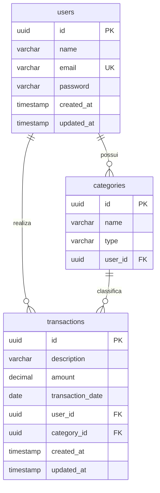

# Documentação do Banco de Dados - FLUXO

Esta documentação descreve a estrutura e modelagem do banco de dados do sistema **FLUXO** no momento atual, baseando-se nas entidades JPA mapeadas no módulo do servidor (`server`).

---

## 1. Visão Geral e Infraestrutura

O ambiente de banco de dados é configurado via contêiner Docker e gerenciado pelo Spring Boot no backend.

- **SGBD:** PostgreSQL 17
- **Porta Padrão:** `5432`
- **Nome do Banco:** `fluxo`
- **Configurações de Conexão:**
  - Definidas no arquivo [application.yaml](file:///Users/casseb/Develop/dev/projects/FLUXO/server/src/main/resources/application.yaml).
  - O serviço local roda a partir do arquivo [docker-compose.yml](file:///Users/casseb/Develop/dev/projects/FLUXO/docker-compose.yml) com credenciais padrões de desenvolvimento (`POSTGRES_USER=postgres` / `POSTGRES_PASSWORD=postgres`).
- **Mecanismo de Geração do Schema:**
  - Atualmente configurado como `spring.jpa.hibernate.ddl-auto: update`, onde o Hibernate sincroniza a estrutura automaticamente com base nas entidades Java.
  - O Flyway está configurado no projeto para migrações futuras, mas atualmente encontra-se desativado (`spring.flyway.enabled: false`).

---

## 2. Diagrama de Entidade-Relacionamento (ERD)

O diagrama a seguir descreve graficamente as tabelas mapeadas e seus respectivos relacionamentos:

---

## 3. Dicionário de Dados

Abaixo estão detalhadas as tabelas do banco de dados correspondentes às entidades JPA do projeto.

### 3.1. Tabela `users`
Mapeada a partir da entidade [User.java](file:///Users/casseb/Develop/dev/projects/FLUXO/server/src/main/java/com/pedrocasseb/fluxo/user/User.java), esta tabela armazena os dados de registro dos usuários do sistema.

| Coluna | Tipo no Banco | Tipo Java | Chave | Nulidade | Detalhes / Restrições |
| :--- | :--- | :--- | :---: | :---: | :--- |
| `id` | `UUID` | `UUID` | PK | Não Nulo | Identificador único gerado automaticamente (`GenerationType.UUID`). |
| `name` | `VARCHAR(255)` | `String` | - | Nulo | Nome do usuário. |
| `email` | `VARCHAR(255)` | `String` | UK | Não Nulo | Endereço de e-mail do usuário (Restrição de Unicidade). |
| `password` | `VARCHAR(255)` | `String` | - | Nulo | Hash da senha de acesso do usuário. |
| `created_at` | `TIMESTAMP` | `LocalDateTime` | - | Não Nulo | Data e hora de criação do registro (Gerido por `@CreationTimestamp`). |
| `updated_at` | `TIMESTAMP` | `LocalDateTime` | - | Não Nulo | Data e hora da última modificação (Gerido por `@UpdateTimestamp`). |

---

### 3.2. Tabela `categories`
Mapeada a partir da entidade [Category.java](file:///Users/casseb/Develop/dev/projects/FLUXO/server/src/main/java/com/pedrocasseb/fluxo/category/Category.java), esta tabela armazena as categorias criadas pelos usuários para organizar suas transações.

| Coluna | Tipo no Banco | Tipo Java | Chave | Nulidade | Detalhes / Restrições |
| :--- | :--- | :--- | :---: | :---: | :--- |
| `id` | `UUID` | `UUID` | PK | Não Nulo | Identificador único gerado automaticamente (`GenerationType.UUID`). |
| `name` | `VARCHAR(255)` | `String` | - | Nulo | Nome descritivo da categoria. |
| `type` | `VARCHAR(255)` | `CategoryType` | - | Nulo | Tipo da categoria, mapeado como String do enum [CategoryType.java](file:///Users/casseb/Develop/dev/projects/FLUXO/server/src/main/java/com/pedrocasseb/fluxo/category/CategoryType.java) (`INCOME` ou `EXPENSE`). |
| `user_id` | `UUID` | `User` | FK | Nulo | Referência ao usuário proprietário desta categoria (Chave estrangeira apontando para `users.id`). |

---

### 3.3. Tabela `transactions`
Mapeada a partir da entidade [FinancialTransaction.java](file:///Users/casseb/Develop/dev/projects/FLUXO/server/src/main/java/com/pedrocasseb/fluxo/transaction/FinancialTransaction.java), esta tabela armazena os registros de receitas e despesas efetuadas pelos usuários.

| Coluna | Tipo no Banco | Tipo Java | Chave | Nulidade | Detalhes / Restrições |
| :--- | :--- | :--- | :---: | :---: | :--- |
| `id` | `UUID` | `UUID` | PK | Não Nulo | Identificador único gerado automaticamente (`GenerationType.UUID`). |
| `description` | `VARCHAR(255)` | `String` | - | Nulo | Detalhamento ou título da transação. |
| `amount` | `NUMERIC(38,2)` | `BigDecimal` | - | Nulo | Valor monetário da transação financeira. |
| `transaction_date` | `DATE` | `LocalDate` | - | Nulo | Data de ocorrência da transação financeira. |
| `user_id` | `UUID` | `User` | FK | Nulo | Referência ao usuário que realizou a transação (Chave estrangeira apontando para `users.id`). |
| `category_id` | `UUID` | `Category` | FK | Nulo | Referência à categoria da transação (Chave estrangeira apontando para `categories.id`). |
| `created_at` | `TIMESTAMP` | `LocalDateTime` | - | Não Nulo | Data e hora de criação do registro (Gerido por `@CreationTimestamp`). |
| `updated_at` | `TIMESTAMP` | `LocalDateTime` | - | Não Nulo | Data e hora da última modificação (Gerido por `@UpdateTimestamp`). |

---

## 4. Detalhes de Relacionamentos e Integridade

1. **Relação Usuário - Categorias (`users` para `categories`):**
   - Relação **1 para N** (`OneToMany` em [User.java](file:///Users/casseb/Develop/dev/projects/FLUXO/server/src/main/java/com/pedrocasseb/fluxo/user/User.java#L37) e `ManyToOne` em [Category.java](file:///Users/casseb/Develop/dev/projects/FLUXO/server/src/main/java/com/pedrocasseb/fluxo/category/Category.java#L32)).
   - Cada usuário pode ter múltiplas categorias personalizadas, mas cada categoria pertence a exatamente um usuário.
   - Carregamento preguiçoso (`FetchType.LAZY`) habilitado para otimização de consultas.

2. **Relação Usuário - Transações (`users` para `transactions`):**
   - Relação **1 para N** (`OneToMany` em [User.java](file:///Users/casseb/Develop/dev/projects/FLUXO/server/src/main/java/com/pedrocasseb/fluxo/user/User.java#L34) e `ManyToOne` em [FinancialTransaction.java](file:///Users/casseb/Develop/dev/projects/FLUXO/server/src/main/java/com/pedrocasseb/fluxo/transaction/FinancialTransaction.java#L36)).
   - Um usuário pode registrar diversas transações.
   - Carregamento preguiçoso (`FetchType.LAZY`) ativado na chave estrangeira `user_id`.

3. **Relação Categoria - Transações (`categories` para `transactions`):**
   - Relação **1 para N** (`OneToMany` em [Category.java](file:///Users/casseb/Develop/dev/projects/FLUXO/server/src/main/java/com/pedrocasseb/fluxo/category/Category.java#L36) e `ManyToOne` em [FinancialTransaction.java](file:///Users/casseb/Develop/dev/projects/FLUXO/server/src/main/java/com/pedrocasseb/fluxo/transaction/FinancialTransaction.java#L40)).
   - Uma transação pode estar associada a uma categoria de classificação. Uma categoria pode possuir múltiplos registros de transação.
   - Carregamento preguiçoso (`FetchType.LAZY`) ativado na chave estrangeira `category_id`.
